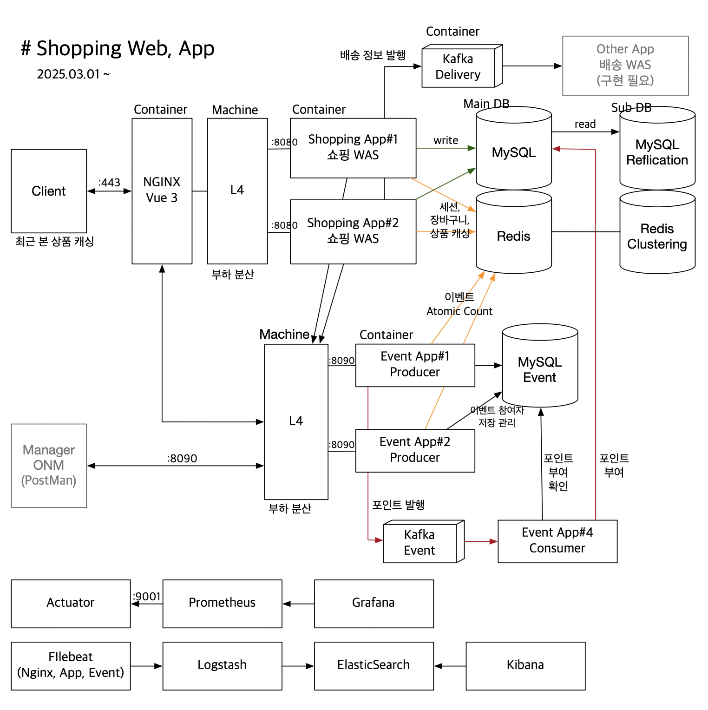
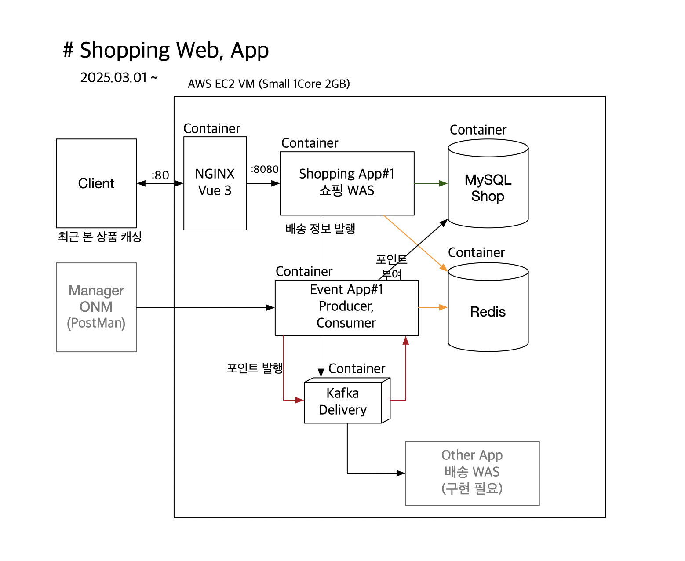
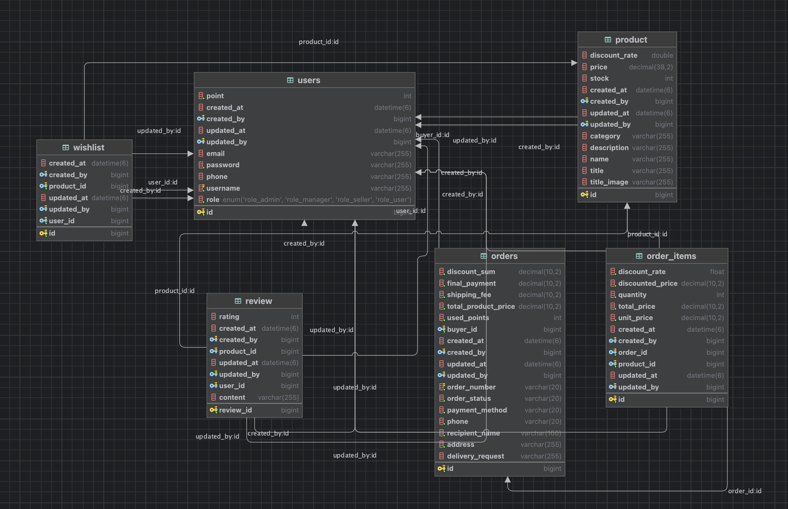

# Shopping API
### 기간: 2025-03-01 ~ 

**Shopping API**는 RESTful API 서비스로
Spring Boot, Spring Security, Spring Data JPA/Hibernate, QueryDSL, Redis, Kafka 등의 기술을 활용하여 사용자 인증, 주문 관리 등 주요 기능을 제공합니다.

이 프로젝트는 확장성과 유지보수를 고려한 모듈화된 아키텍처로 구성되어 있으며, 프론트엔드 애플리케이션과 원활하게 통신할 수 있도록 설계되었습니다.

## 서비스 URL
- web 서버 : http://www.ezmartket.store
- 스마트폰에 최적화 되어 개발되었습니다.

## 주요 기능
- **선착순 이벤트를 위한 인벤트성 아키텍처 설계 및 모듈 개발**
    - 모듈 소스 : https://github.com/youseonghyeon/shipping-event.git
    - L4 부하분산과 Redis Atomic 연산을 통한 이벤트 처리
- **사용자 인증 및 권한 부여**
    - JSON 기반 로그인 및 로그아웃 API 제공
    - Redis를 활용한 로그인 세션 관리
    - RSA 암호화를 이용한 Client to Server 간 로그인 정보 보안
    - RememberMe를 이용한 자동 로그인 기능
- **주문 관리**
    - 상품에 대한 장바구니, 주문, 주문된 개별 상품 관리(리뷰 등)
    - Kafka Bus를 통한 주문 처리 이벤트 발행
- **RESTful API 설계**
    - 명확한 엔드포인트 구성 및 HTTP 상태 코드를 활용한 응답 처리
    - ApiResponse 클래스 규격을 사용하여 일관된 응답 형식 제공
- **데이터 영속성**
    - Spring Data JPA/Hibernate, QueryDSL 를 통한 ORM 기반 데이터베이스 연동

## 기술 스택

- **Java 21LTS**
- **Spring Boot 3.4.3**
- **Spring Security 6** (JSON 커스텀 로그인)
- **Spring Data Redis**
- **Spring Data JPA / Hibernate / QueryDSL**
- **Spring for Apache Kafka 3.8.1**
- **JaCoCo 테스트 커버리지 측정**
- **H2DB/MySQL 쿼리캐싱** (데이터베이스)

## 서비스 아키텍처 설계 (PRD)

## 서비스 아키텍처 설계 (DEV)

## DB 스키마

