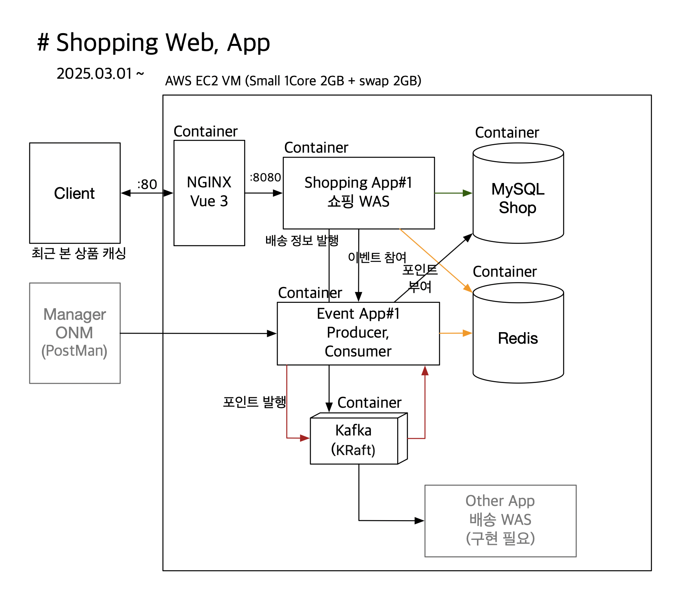

# Shopping API
### 기간: 2025-03-01 ~ 

**Shopping API**는 RESTful API 서비스로
Spring Boot, Spring Security, Spring Data JPA/Hibernate, QueryDSL, Redis, Kafka 등의 기술을 활용하여 사용자 인증, 주문 관리 등 주요 기능을 제공합니다.

이 프로젝트는 확장성과 유지보수를 고려한 모듈화된 아키텍처로 구성되어 있으며, 프론트엔드 애플리케이션과 원활하게 통신할 수 있도록 설계되었습니다.

## 서비스 URL
- web 서버 : [#서비스 홈페이지](http://www.ezmartket.store)
- 스마트폰에 최적화 되어 개발되었습니다.

## 주요 기능
- **Vue 3 를 이용한 프론트 개발**
    - 소스 : [#Vue_프론트_소스](https://github.com/youseonghyeon/shopping-vue.git)
- **선착순 이벤트를 위한 인벤트성 아키텍처 설계 및 모듈 개발**
    - 모듈 소스 : [#이벤트_모듈_소스](https://github.com/youseonghyeon/shipping-event.git)
    - L4 부하분산과 Redis Atomic 연산을 통한 이벤트 처리
- **사용자 인증 및 권한 부여**
    - JSON 기반 로그인 및 로그아웃 API 제공
    - Redis를 활용한 로그인 세션 관리
    - RSA 암호화를 이용한 Client to Server 간 로그인 정보 보안
    - RememberMe를 이용한 자동 로그인 기능
- **주문 관리**
    - 상품에 대한 장바구니, 주문, 주문된 개별 상품 관리(리뷰 등)
    - Kafka Bus를 통한 주문 처리 이벤트 발행
- **RESTful API 설계**
    - 명확한 엔드포인트 구성 및 HTTP 상태 코드를 활용한 응답 처리
    - ApiResponse 클래스 규격을 사용하여 일관된 응답 형식 제공
- **데이터 영속성**
    - Spring Data JPA/Hibernate, QueryDSL 를 통한 ORM 기반 데이터베이스 연동
- **쿼리 캐싱 및 2차 캐싱**
    - QueryDSL 쿼리 캐싱을 이용한 상품 조회 페이지 최적화
    - Redis 캐싱을 이용한 상품 정보 조회 최적화
-  **Kafka 설정**
    - KRaft 기반의 단일 노드 Kafka 클러스터로 구성하여 ZooKeeper 의존 제거
    - 최소 리소스로 경량화된 브로커 설정 적용 (1코어 2GB 환경 최적화)
    - Spring Kafka 기반으로 메시지 전송 및 소비 구조 구현, 재시도 및 모니터링 로직 포함
    - fail-fast 전략을 사용하여 worker 비정상 기동시 애플리케이션 종료

## 기술 스택

- **Java 21LTS**
- **Spring Boot 3.4.3**
- **Spring Security 6** (JSON 커스텀 로그인)
- **Spring Data Redis**
- **Spring Data JPA / Hibernate / QueryDSL**
- **Spring for Apache Kafka 3.8.1**
- **JaCoCo 테스트 커버리지 측정**
- **H2DB/MySQL 쿼리캐싱** (데이터베이스)

## 서비스 아키텍처 설계 (PRD)


## 서비스 아키텍처 설계 (DEV)



## Kafka 기반 비동기 메시지 처리 아키텍처 개선

### 문제 상황
- 주문 완료 시 Kafka를 통해 메시지를 전송하고 있었으나,
- 트랜잭션 커밋 전에 메시지가 발송되어 **데이터 정합성 문제** 발생 가능성 존재
- 비동기 처리 도중 서비스가 재기동되면 메시지 유실 위험 존재

### 해결 전략
- Kafka 메시지 전송을 트랜잭션 이후로 분리하여 **정합성 확보**
- 메시지를 메모리 기반 BlockingQueue에 저장하고, 별도 **워커 스레드에서 비동기 전송**
- 메시지 전송 실패 시 **자동 재시도 로직 및 지연 큐 처리** 구현
- 워커 스레드가 **예외로 종료될 경우 자동 감지 및 재기동**하는 감시 스레드 추가

###  구현 방식
- `LinkedBlockingQueue`를 활용한 Thread-safe 메시지 큐 구성
- `Thread`를 직접 생성하여 2개의 worker가 Kafka 메시지 전송 전담
- 실패 메시지 재시도를 위해 `ScheduledExecutorService`로 5초 후 재 enqueue
- Spring Boot의 `@EventListener(ApplicationReadyEvent.class)`를 활용해 **애플리케이션 기동 이후 워커 스레드 실행**
- 모든 워커와 메시지 흐름에 대해 로그 및 예외 처리 설계
- kafka worker thread 관리 클래스 [KafkaWorkerManager.java](src/main/java/com/shop/shoppingapi/producer/KafkaWorkerManager.java)
- fail-fast 전략을 사용하여 worker 비정상 기동시 애플리케이션 종료

### 결과
- Kafka 메시지 전송 시점이 트랜잭션 이후로 이동되어 정합성 확보
- 메시지 유실 가능성 최소화 및 운영 안정성 향상
- Thread가 예외로 종료되더라도 시스템이 자가 복구 가능하도록 설계
- Redis, Kafka Consumer 등 외부 시스템으로 확장 가능한 구조로 설계

### 🛠️ 주요 기술 스택
- Spring Boot, Kafka, BlockingQueue, ScheduledExecutorService, Java Thread API

## DB 스키마 (메인 비즈니스)


## DB 스키마 (이벤트)


## Docker compose 구성
[docker-compose.yml](docker-compose-sample.yml)

## Container 구성 및 OS(VM) 리소스

```
docker stats --no-stream
CONTAINER ID   NAME             CPU %     MEM USAGE / LIMIT    MEM %     NET I/O           BLOCK I/O         PIDS
d45fcb4089df   shopping-event   0.22%     214.3MiB / 1.91GiB   10.96%    3.12MB / 3.33MB   28MB / 29MB       36
e413ebe10fad   vue-app          0.00%     3.848MiB / 1.91GiB   0.20%     73.3kB / 831kB    4.27MB / 172kB    2
ec491eee585a   shopping-app     0.14%     366.6MiB / 1.91GiB   18.74%    264kB / 261kB     72.7MB / 22.9MB   35
e5ad1d6d2540   mysql            0.33%     312.5MiB / 1.91GiB   15.98%    217kB / 163kB     46.8MB / 155MB    48
d36c1774f575   kafka            0.73%     396.6MiB / 1.91GiB   20.27%    3.34MB / 3.12MB   40.8MB / 493MB    91
d674d8ae1cb9   redis            0.34%     7.777MiB / 1.91GiB   0.40%     29.1kB / 74.1kB   11.8MB / 238kB    6


top - 19:07:03 up  5:06,  2 users,  load average: 1.35, 0.76, 0.30
Tasks: 143 total,   1 running, 142 sleeping,   0 stopped,   0 zombie
%Cpu(s):  0.0 us,  5.3 sy,  0.0 ni, 89.5 id,  5.3 wa,  0.0 hi,  0.0 si,  0.0 st
MiB Mem :   1956.0 total,     76.1 free,   1486.4 used,    393.5 buff/cache
MiB Swap:   2048.0 total,   1991.0 free,     57.0 used.    315.3 avail Mem 
```

## OS(VM) 구조
```
root directory
│
├── app
│   ├── config
│   │       ├── nginx.conf
│   │       ├── .env
│   │       └── private_key.pem
│   ├── docker-compose.yml
│   └── restart.sh
│   
├── applog
│   ├── api
│   │       ├── ...
..  │       ├── shop-api.2025-03-21.log
    │       ├── shop-api.2025-03-22.log
    │       ├── shop-api.log
    │       └── simple-shop-api.log
    ├── event
    │       ├── ...
    │       ├── shop-event.2025-03-22.log
    │       └── shop-event.log
    ├── mysql
    │       ├── error.log
    │       └── general.log
    └── nginx
        ├── access.log
        └── error.log
```


## 선착순 이벤트 부하 테스트 결과 [#결과 상세](https://github.com/youseonghyeon/shipping-event.git)
- 예상 사용자 : 500명
- db-max-connection-size: 500
- 수행시간 : 30초
- 준비 수량 : 1,000개
- 요청 수 : 11,703개
- 성공 수량 : 1000개
- 실패 수량 : 0개
- Redis + Lua Script를 활용하여 1,000명까지 이벤트 참여 성공
- 테스트를 통해 이벤트 참가 제한 기능이 정확히 동작함을 검증
- 개선 방안 : 건당 1회 db 처리 및 kafka 처리에서 50건씩 묶어 batch 처리로 변경 (I/O 감소 및 네트워크 비용감소)
- 부하 테스트 결과 : 평균 응답 시간: 1.17초 (성공 요청 평균: 4.37초)
```
         /\      Grafana   /‾‾/  
    /\  /  \     |\  __   /  /   
   /  \/    \    | |/ /  /   ‾‾\ 
  /          \   |   (  |  (‾)  |
 / __________ \  |_|\_\  \_____/ 

     execution: local
        script: event-test.js
        output: -

     scenarios: (100.00%) 1 scenario, 500 max VUs, 1m0s max duration (incl. graceful stop):
              * default: 500 looping VUs for 30s (gracefulStop: 30s)

     ✗ status was 200
      ↳  8% — ✓ 1000 / ✗ 10703

     checks.........................: 8.54%  1000 out of 11703
     data_received..................: 2.5 MB 81 kB/s
     data_sent......................: 2.5 MB 84 kB/s
     http_req_blocked...............: avg=16.76ms min=0s       med=12.17ms  max=105.9ms  p(90)=26.46ms p(95)=28.89ms
     http_req_connecting............: avg=14.69ms min=0s       med=12.16ms  max=77.04ms  p(90)=26.44ms p(95)=28.52ms
     http_req_duration..............: avg=1.17s   min=22.04ms  med=814.7ms  max=7.89s    p(90)=2.05s   p(95)=2.58s  
       { expected_response:true }...: avg=4.37s   min=910.82ms med=2.72s    max=7.89s    p(90)=7.11s   p(95)=7.37s  
     http_req_failed................: 91.45% 10703 out of 11703
     http_req_receiving.............: avg=1.33ms  min=0s       med=16µs     max=332.14ms p(90)=295µs   p(95)=2.41ms 
     http_req_sending...............: avg=8.98µs  min=1µs      med=6µs      max=1.59ms   p(90)=15µs    p(95)=23µs   
     http_req_tls_handshaking.......: avg=0s      min=0s       med=0s       max=0s       p(90)=0s      p(95)=0s     
     http_req_waiting...............: avg=1.17s   min=22.03ms  med=814ms    max=7.69s    p(90)=2.04s   p(95)=2.57s  
     http_reqs......................: 11703  384.019852/s
     iteration_duration.............: avg=1.29s   min=227.3ms  med=930.65ms max=8.09s    p(90)=2.15s   p(95)=2.68s  
     iterations.....................: 11703  384.019852/s
     vus............................: 500    min=500            max=500
     vus_max........................: 500    min=500            max=500


running (0m30.5s), 000/500 VUs, 11703 complete and 0 interrupted iterations
default ✓ [======================================] 500 VUs  30s
```
