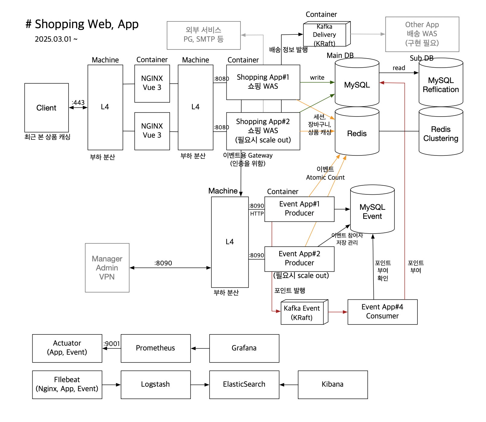

# Shopping API
### 기간: 2025-03-01 ~ 

**Shopping API**는 RESTful API 서비스로
Spring Boot, Spring Security, Spring Data JPA/Hibernate, QueryDSL, Redis, Kafka 등의 기술을 활용하여 사용자 인증, 주문 관리 등 주요 기능을 제공합니다.

이 프로젝트는 확장성과 유지보수를 고려한 모듈화된 아키텍처로 구성되어 있으며, 프론트엔드 애플리케이션과 원활하게 통신할 수 있도록 설계되었습니다.

## 서비스 URL
- web 서버 : http://www.ezmartket.store
- 스마트폰에 최적화 되어 개발되었습니다.

## 주요 기능
- **Vue 3 를 이용한 프론트 개발**
    - 소스 : https://github.com/youseonghyeon/shopping-vue.git
- **선착순 이벤트를 위한 인벤트성 아키텍처 설계 및 모듈 개발**
    - 모듈 소스 : https://github.com/youseonghyeon/shipping-event.git
    - L4 부하분산과 Redis Atomic 연산을 통한 이벤트 처리
- **사용자 인증 및 권한 부여**
    - JSON 기반 로그인 및 로그아웃 API 제공
    - Redis를 활용한 로그인 세션 관리
    - RSA 암호화를 이용한 Client to Server 간 로그인 정보 보안
    - RememberMe를 이용한 자동 로그인 기능
- **주문 관리**
    - 상품에 대한 장바구니, 주문, 주문된 개별 상품 관리(리뷰 등)
    - Kafka Bus를 통한 주문 처리 이벤트 발행
- **RESTful API 설계**
    - 명확한 엔드포인트 구성 및 HTTP 상태 코드를 활용한 응답 처리
    - ApiResponse 클래스 규격을 사용하여 일관된 응답 형식 제공
- **데이터 영속성**
    - Spring Data JPA/Hibernate, QueryDSL 를 통한 ORM 기반 데이터베이스 연동
- **쿼리 캐싱 및 2차 캐싱**
    - QueryDSL 쿼리 캐싱을 이용한 상품 조회 페이지 최적화
    - Redis 캐싱을 이용한 상품 정보 조회 최적화
-  **Kafka 설정**
    - KRaft 기반의 단일 노드 Kafka 클러스터로 구성하여 ZooKeeper 의존 제거
    - 최소 리소스로 경량화된 브로커 설정 적용 (1코어 2GB 환경 최적화)
    - Spring Kafka 기반으로 메시지 전송 및 소비 구조 구현, 재시도 및 모니터링 로직 포함
    - fail-fast 전략을 사용하여 worker 비정상 기동시 애플리케이션 종료

## 기술 스택

- **Java 21LTS**
- **Spring Boot 3.4.3**
- **Spring Security 6** (JSON 커스텀 로그인)
- **Spring Data Redis**
- **Spring Data JPA / Hibernate / QueryDSL**
- **Spring for Apache Kafka 3.8.1**
- **JaCoCo 테스트 커버리지 측정**
- **H2DB/MySQL 쿼리캐싱** (데이터베이스)

## 서비스 아키텍처 설계 (PRD)


## 서비스 아키텍처 설계 (DEV)


## Kafka 기반 비동기 메시지 처리 아키텍처 개선

### 문제 상황
- 주문 완료 시 Kafka를 통해 메시지를 전송하고 있었으나,
- 트랜잭션 커밋 전에 메시지가 발송되어 **데이터 정합성 문제** 발생 가능성 존재
- 비동기 처리 도중 서비스가 재기동되면 메시지 유실 위험 존재

### 해결 전략
- Kafka 메시지 전송을 트랜잭션 이후로 분리하여 **정합성 확보**
- 메시지를 메모리 기반 BlockingQueue에 저장하고, 별도 **워커 스레드에서 비동기 전송**
- 메시지 전송 실패 시 **자동 재시도 로직 및 지연 큐 처리** 구현
- 워커 스레드가 **예외로 종료될 경우 자동 감지 및 재기동**하는 감시 스레드 추가

###  구현 방식
- `LinkedBlockingQueue`를 활용한 Thread-safe 메시지 큐 구성
- `Thread`를 직접 생성하여 2개의 worker가 Kafka 메시지 전송 전담
- 실패 메시지 재시도를 위해 `ScheduledExecutorService`로 5초 후 재 enqueue
- Spring Boot의 `@EventListener(ApplicationReadyEvent.class)`를 활용해 **애플리케이션 기동 이후 워커 스레드 실행**
- 모든 워커와 메시지 흐름에 대해 로그 및 예외 처리 설계
- kafka worker thread 관리 클래스 [KafkaWorkerManager.java](src/main/java/com/shop/shoppingapi/producer/KafkaWorkerManager.java)
- fail-fast 전략을 사용하여 worker 비정상 기동시 애플리케이션 종료

### 결과
- Kafka 메시지 전송 시점이 트랜잭션 이후로 이동되어 정합성 확보
- 메시지 유실 가능성 최소화 및 운영 안정성 향상
- Thread가 예외로 종료되더라도 시스템이 자가 복구 가능하도록 설계
- Redis, Kafka Consumer 등 외부 시스템으로 확장 가능한 구조로 설계

### 🛠️ 주요 기술 스택
- Spring Boot, Kafka, BlockingQueue, ScheduledExecutorService, Java Thread API

## DB 스키마 (메인 비즈니스)


## DB 스키마 (이벤트)


## Docker compose 구성
[docker-compose.yml](docker-compose-sample.yml)

## Container 구성 및 OS(VM) 리소스

```
docker stats --no-stream
CONTAINER ID   NAME             CPU %     MEM USAGE / LIMIT    MEM %     NET I/O           BLOCK I/O         PIDS
d45fcb4089df   shopping-event   0.22%     214.3MiB / 1.91GiB   10.96%    3.12MB / 3.33MB   28MB / 29MB       36
e413ebe10fad   vue-app          0.00%     3.848MiB / 1.91GiB   0.20%     73.3kB / 831kB    4.27MB / 172kB    2
ec491eee585a   shopping-app     0.14%     366.6MiB / 1.91GiB   18.74%    264kB / 261kB     72.7MB / 22.9MB   35
e5ad1d6d2540   mysql            0.33%     312.5MiB / 1.91GiB   15.98%    217kB / 163kB     46.8MB / 155MB    48
d36c1774f575   kafka            0.73%     396.6MiB / 1.91GiB   20.27%    3.34MB / 3.12MB   40.8MB / 493MB    91
d674d8ae1cb9   redis            0.34%     7.777MiB / 1.91GiB   0.40%     29.1kB / 74.1kB   11.8MB / 238kB    6


top - 19:07:03 up  5:06,  2 users,  load average: 1.35, 0.76, 0.30
Tasks: 143 total,   1 running, 142 sleeping,   0 stopped,   0 zombie
%Cpu(s):  0.0 us,  5.3 sy,  0.0 ni, 89.5 id,  5.3 wa,  0.0 hi,  0.0 si,  0.0 st
MiB Mem :   1956.0 total,     76.1 free,   1486.4 used,    393.5 buff/cache
MiB Swap:   2048.0 total,   1991.0 free,     57.0 used.    315.3 avail Mem 
```

## OS(VM) 구조
```
root directory
│
├── app
│   ├── config
│   │       ├── nginx.conf
│   │       ├── .env
│   │       └── private_key.pem
│   ├── docker-compose.yml
│   └── restart.sh
│   
├── applog
│   ├── api
│   │       ├── ...
..  │       ├── shop-api.2025-03-21.log
    │       ├── shop-api.2025-03-22.log
    │       ├── shop-api.log
    │       └── simple-shop-api.log
    ├── event
    │       ├── ...
    │       ├── shop-event.2025-03-22.log
    │       └── shop-event.log
    ├── mysql
    │       ├── error.log
    │       └── general.log
    └── nginx
        ├── access.log
        └── error.log
```
